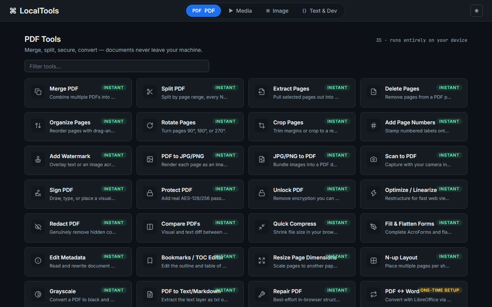
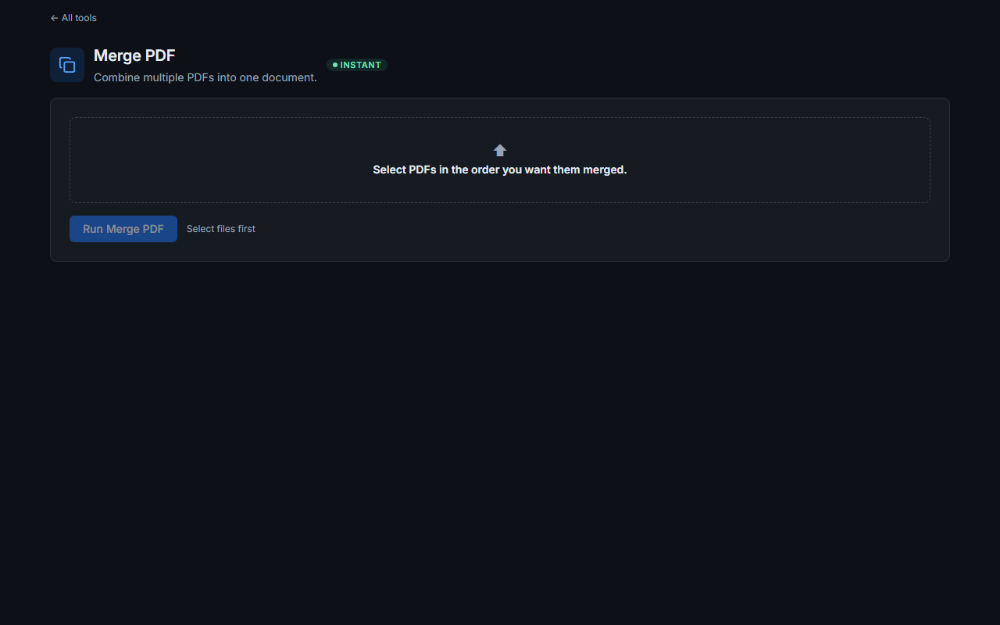
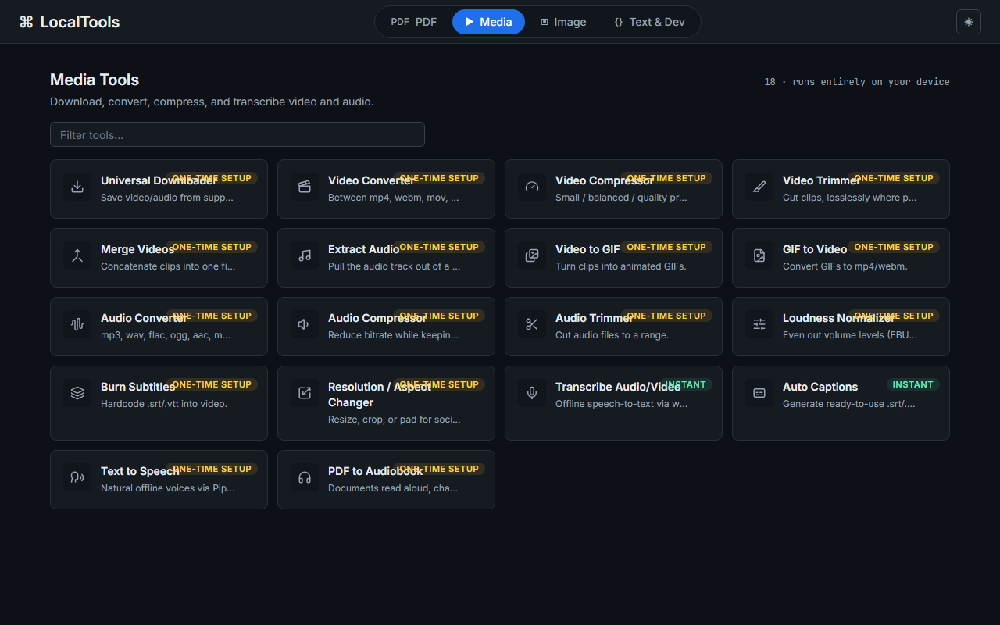
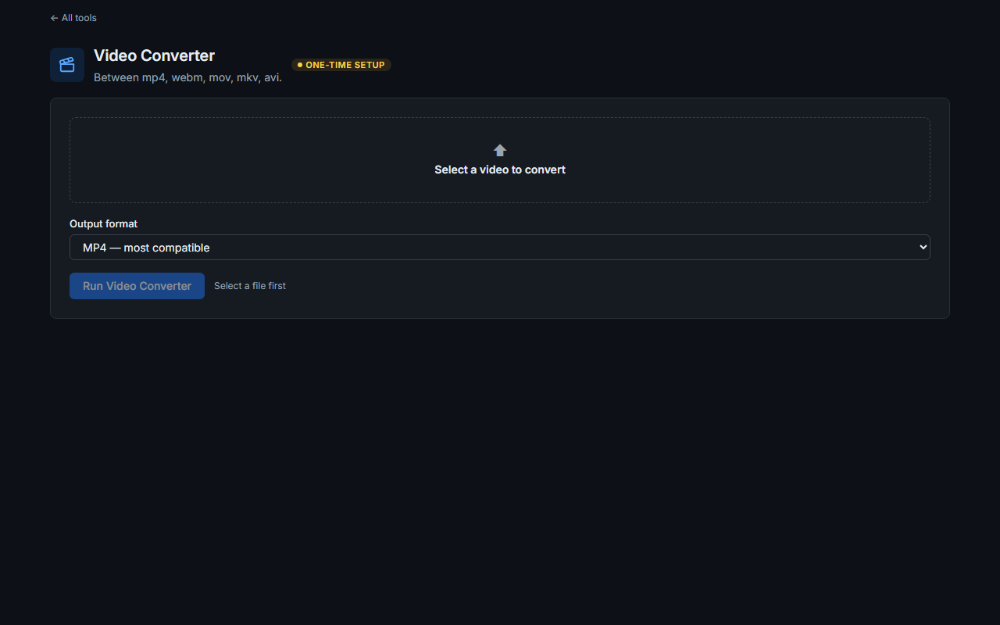
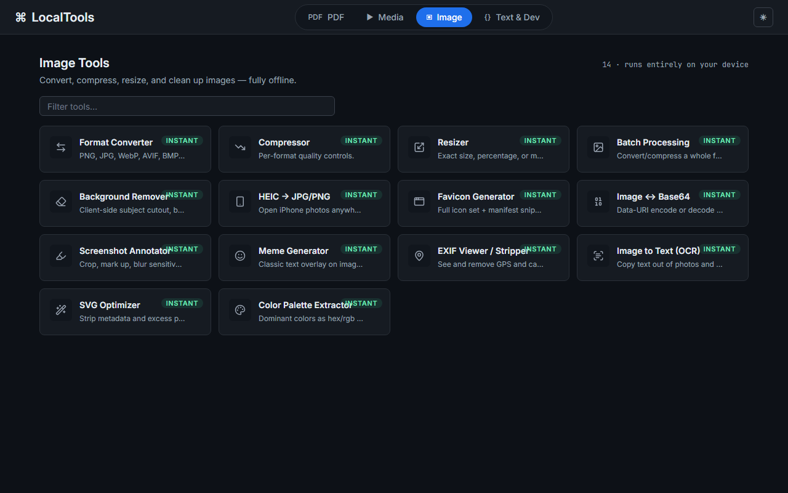
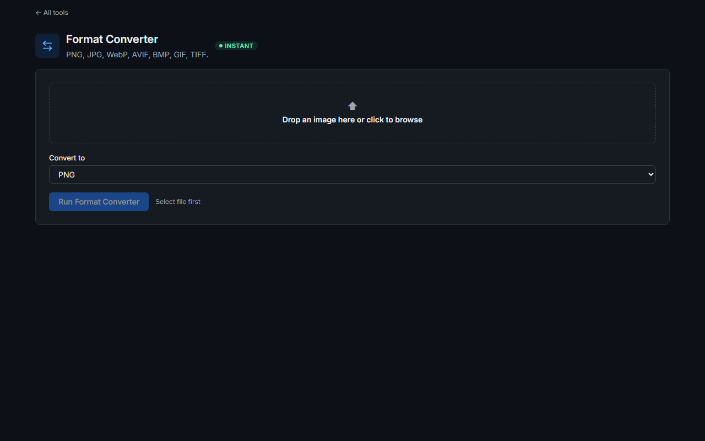
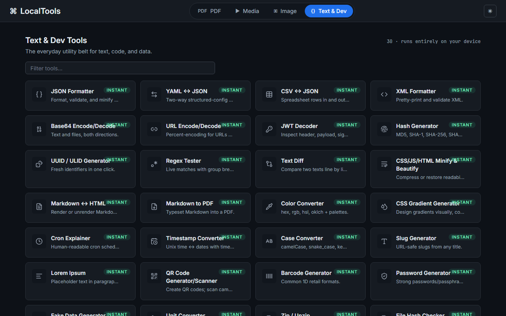
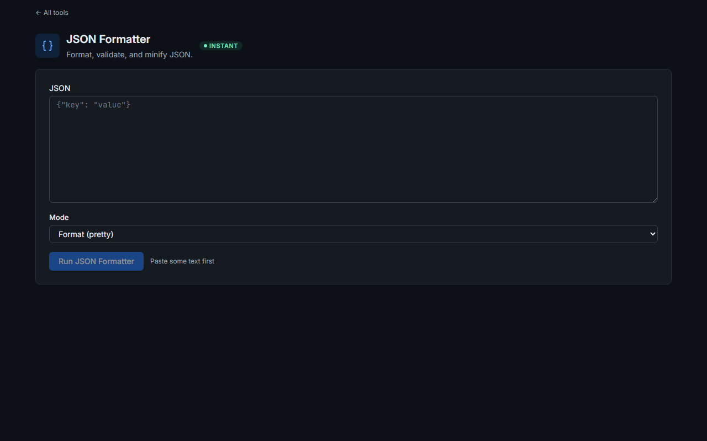
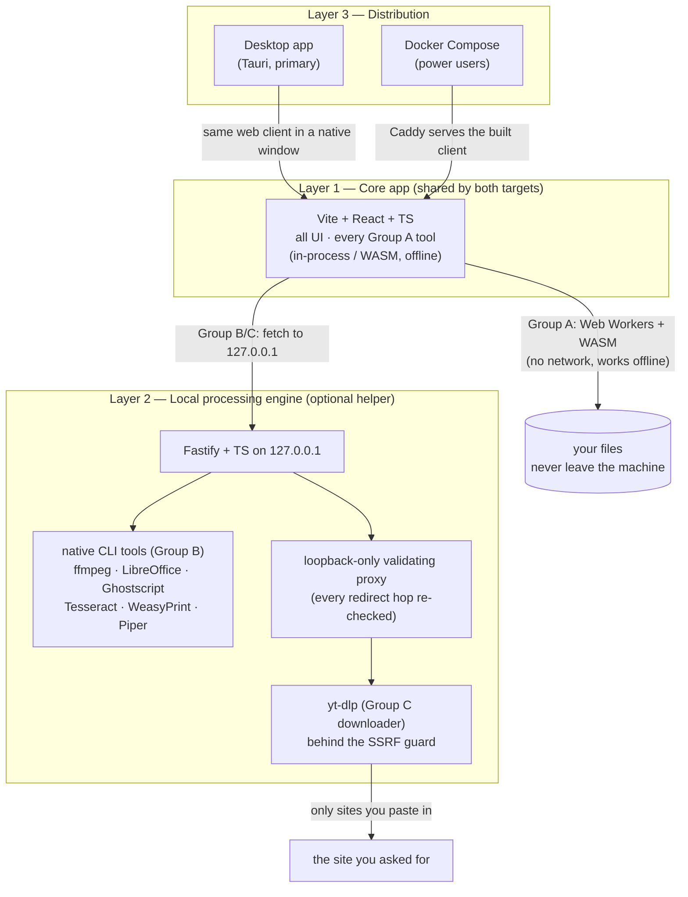

# LocalTools

Self-hosted, open-source, privacy-first alternative to the paywalled/rate-limited
"free tool" websites — iLovePDF, social media downloaders, image converters,
JSON formatters, and their whole category. Every tool those sites gate is free
and unlimited here: **97 tools across four suites**, running on your machine.

**Status:** 15 of 15 phases built; v1.0.0 tag pending CI unblock (see [`SUMMARY.md`](SUMMARY.md)).

[](LICENSE)

## Why this exists

Every tool in this repo runs on your machine. Files processed by Group A tools
never leave it; Group B uses a local helper; only the Media downloader makes
outbound requests, and then only via yt-dlp to sites you paste in. No telemetry,
no analytics, no third-party CDNs, no accounts, no rate limits.

## The four suites

| Suite                                       | Tools | What's inside                                                                                 |
| ------------------------------------------- | ----- | --------------------------------------------------------------------------------------------- |
| [**PDF Tools**](#pdf-tools-35)              | 35    | merge, split, organize, redact (genuine content removal), sign, OCR, PDF/A, Office interop    |
| [**Media Tools**](#media-tools-18)          | 18    | yt-dlp downloader, ffmpeg convert/compress/trim/merge, GIF, subtitles, whisper STT, Piper TTS |
| [**Image Tools**](#image-tools-14)          | 14    | convert/compress/resize, HEIC, background remover (ONNX), EXIF strip, OCR, favicon, palette   |
| [**Text & Dev Tools**](#text--dev-tools-30) | 30    | JSON/YAML/CSV/XML, hashes, JWT, UUID, regex, diff, QR/barcode, color, cron, passwords         |

### Home


### PDF Tools




### Media Tools




### Image Tools




### Text & Dev Tools




_(Screenshots of the production build, captured by
[`apps/client/scripts/capture-screenshots.mjs`](apps/client/scripts/capture-screenshots.mjs).)_

## Architecture



Group definitions (PROJECT_SPEC Section 3):

- **Group A** — in-process/WASM in the browser tab (Web Worker). No native
  helper, no network, works offline. 73 tools.
- **Group B** — needs the local engine (Layer 2), which shells out to native
  CLI tools on your files; no third-party network calls. 23 tools.
- **Group C** — engine + outbound requests to sites you paste in (downloader
  only; the full Section 5.8 SSRF-prevention set). 1 tool.

Full architecture detail: [ARCHITECTURE.md](ARCHITECTURE.md).

## Full tool list (97)

### PDF Tools (35)

**Group A — in-browser, offline (27):**
Merge PDF · Split PDF · Extract Pages · Delete Pages · Organize Pages ·
Rotate Pages · Crop Pages · Add Page Numbers · Add Watermark ·
PDF to JPG/PNG · JPG/PNG to PDF · Scan to PDF · Sign PDF · Protect PDF ·
Unlock PDF · Optimize / Linearize · Redact PDF · Compare PDFs ·
Quick Compress · Fill & Flatten Forms · Edit Metadata · Bookmarks / TOC Editor ·
Resize Page Dimensions · N-up Layout · Grayscale ·
PDF to Text/Markdown · Repair PDF

**Group B — local engine (8):**
PDF ↔ Word · PDF ↔ Excel · PDF ↔ PowerPoint · OCR PDF · Deep Compress ·
PDF to PDF/A · Deep Repair · HTML to PDF

### Media Tools (18)

**Group C — downloader (1):**
Universal Downloader (yt-dlp, behind the SSRF guard)

**Group B — local engine, ffmpeg/Piper (15):**
Video Converter · Video Compressor · Video Trimmer · Merge Videos ·
Extract Audio · Video to GIF · GIF to Video · Audio Converter ·
Audio Compressor · Audio Trimmer · Loudness Normalizer · Burn Subtitles ·
Resolution / Aspect Changer · Text to Speech · PDF to Audiobook

**Group A — in-browser, whisper WASM (2):**
Transcribe Audio/Video · Auto Captions

### Image Tools (14)

**Group A — in-browser, offline (14):**
Format Converter · Compressor · Resizer · Batch Processing ·
Background Remover · HEIC → JPG/PNG · Favicon Generator · Image ↔ Base64 ·
Screenshot Annotator · Meme Generator · EXIF Viewer / Stripper ·
Image to Text (OCR) · SVG Optimizer · Color Palette Extractor

### Text & Dev Tools (30)

**Group A — in-browser, offline (30):**
JSON Formatter · YAML ↔ JSON · CSV ↔ JSON · XML Formatter ·
Base64 Encode/Decode · URL Encode/Decode · JWT Decoder · Hash Generator ·
UUID / ULID Generator · Regex Tester · Text Diff · CSS/JS/HTML Minify & Beautify ·
Markdown ↔ HTML · Markdown to PDF · Color Converter ·
CSS Gradient Generator · Cron Explainer · Timestamp Converter ·
Case Converter · Slug Generator · Lorem Ipsum · QR Code Generator/Scanner ·
Barcode Generator · Password Generator · Fake Data Generator ·
Unit Converter · Zip / Unzip · File Hash Checker ·
Sitemap / robots.txt Generator · OG Preview Generator

## Quick start (development)

Prerequisites: Node.js ≥ 22, pnpm ≥ 10 (`corepack enable` or `npm i -g pnpm`).

```bash
pnpm install
pnpm dev        # client at http://localhost:5173 · engine API at 127.0.0.1:8787/healthz
pnpm build      # build all workspaces
pnpm verify     # format + lint + typecheck + build gate
```

## Docker quick start

```bash
cp .env.example .env   # defaults are safe: loopback-only engine binding
docker compose up --build
# client → http://localhost:5173 · engine → 127.0.0.1:8787/healthz
```

The engine binds to loopback only. Exposing beyond localhost requires both
`LOCALTOOLS_EXPOSE=true` and a ≥32-char `LOCALTOOLS_AUTH_TOKEN`, enforced at boot
(Section 5.1). See [.env.example](.env.example).

## Desktop app (Tauri) — install & first run

The desktop build wraps the same web client in a native window and runs the
processing engine as a local, loopback-only background process — no terminal
needed for anything below.

**First launch after install — per-OS "unsigned app" bypass (one time):**

The installers are not yet code-signed (signing is a Phase 15 item), so each OS
shows a one-time warning on first launch. These are the exact steps to get
past each one:

- **Windows:** the installer or app may trigger Microsoft Defender
  SmartScreen — "Windows protected your PC". Click **More info**, then
  **Run anyway**. This appears once; the app then launches normally.
- **macOS:** Gatekeeper blocks apps from unidentified developers. In Finder,
  **right-click (or Control-click) the app → Open → Open** in the dialog
  ("LocalTools" can't be verified…). Alternatively System Settings →
  Privacy & Security → **Open Anyway**. Once opened this way, subsequent
  launches are normal.
- **Linux (AppImage):** AppImages need the executable bit — in your file
  manager, right-click the AppImage → Properties → Permissions → check
  "Allow executing file as program", or in a terminal `chmod +x
LocalTools_*.AppImage` (a one-time step, not a security warning).

**On first use of a tool that needs a native helper** (video download,
PDF↔Office conversion, deep compression, OCR, media conversion,
text-to-speech…), the app shows a friendly one-time prompt like
_"Downloading videos needs yt-dlp — a small one-time download (~30MB) that
keeps working offline afterwards."_ Downloads are URL-pinned and
SHA-256-verified, cached in the app's local data directory, and never need
re-downloading. Everything else keeps working while a download runs, and a
failed download can always be retried.

If you skip or lose a download, just run the tool again — the prompt comes
back. In Docker deployments the same helpers ship inside the engine image
instead.

## Legal & ethical use (Media suite)

This tool is built the same way, and is legal to build and distribute, as
long-established open-source downloaders (yt-dlp, youtube-dl, gallery-dl). It
does not circumvent DRM and only downloads content already served to any
visitor's browser. Many platforms' Terms of Service restrict downloading even
without DRM — using the downloader may violate the ToS of the site you
download from; that's your responsibility to consider. Recommended uses: your
own uploads, Creative Commons / public-domain content, personal offline
viewing of content you have the right to access, and archival or educational
uses consistent with your local copyright law. No DRM-stripping,
paywall/login-bypass, or bulk-redistribution feature exists or will be
added. Full notice: [LEGAL.md](LEGAL.md).

## Performance & size (Section 14.5 — Phase 14 record)

Measured on the production client build (`vite preview`, Lighthouse 13.4.1,
system Chrome headless; three consecutive runs, identical scores):

| Metric                                 | Phase 2 baseline | Phase 14 (current, 97 tools) | Budget / rule                                                         |
| -------------------------------------- | ---------------- | ---------------------------- | --------------------------------------------------------------------- |
| Lighthouse Performance                 | 82               | **79**                       | no >10-point regression (spec 14.5) — 3-point delta, within tolerance |
| Lighthouse Accessibility               | 100              | 100                          | —                                                                     |
| Lighthouse Best Practices              | 100              | 100                          | —                                                                     |
| Lighthouse SEO                         | 91               | 91                           | —                                                                     |
| Initial JS+CSS (gzipped)               | 63.9KB           | **121.60KB**                 | 250KB budget (CI-gated, fails the build)                              |
| Main-thread long tasks, 50MB PDF merge | —                | **0 tasks / 0ms**            | worker-offload check (CI-gated)                                       |

Notes on the 3-point performance delta: with 90+ more tools and the full
worker/bridge plumbing landed since Phase 2, the initial bundle roughly
doubled (still less than half the budget) and TBT stayed at 0ms / CLS 0.
The measured LCP (~3.9s) is dominated by headless-Chrome font-render
overhead on the dev host (server-response 0ms, network RTT 0ms,
main-thread 0.7s) — not app work. The number is recorded honestly; the
gate that matters (bundle size + worker offload) is automated in CI.

**Docker engine image size (Section 11):** the image is intentionally
heavy — it bundles Node 22 slim plus Ghostscript, Tesseract (+eng data),
LibreOffice, ffmpeg, WeasyPrint, pinned yt-dlp 2026.08.19, and Piper
(with SHA-verified voices fetched lazily at runtime). Stripping the npm
CLI from the runtime image (the Trivy-driven fix) cut it by ~80MB and
removed 1 CRITICAL + 10 HIGH CVEs from npm's own tree. The exact final
size is printed by the CI compose-stack job (`docker images` step) —
record it here from the next green CI run. A `docker-compose.slim.yml`
variant without the Media suite's native tools is a v1.1 nice-to-have
per the spec.

## Security

Loopback-only engine binding, arg-array subprocess execution (never shell
strings), magic-byte upload validation, per-request temp dirs with
guaranteed cleanup, and a full SSRF-prevention set on the downloader.
Details: [SECURITY.md](SECURITY.md) and [ARCHITECTURE.md](ARCHITECTURE.md#security-boundaries-summary).

## Status & continuity docs

- [`SUMMARY.md`](SUMMARY.md) — current project state ("catch me up" document)
- [`HANDOFF.md`](HANDOFF.md) — exact resume point for the next work session
- [`DECISIONS.md`](DECISIONS.md) — every non-obvious call and its reasoning
- [`TESTS.md`](TESTS.md) — automated + manual test log

## Contributing

See [CONTRIBUTING.md](CONTRIBUTING.md). Ground rules: privacy by default,
security is review-blocking, tests travel with features.

## Roadmap

15 phases per PROJECT_SPEC Section 15, from scaffold through v1.0.0 release —
built through Phase 15; the v1.0.0 tag is pending the CI unblock. Possible **v2 ideas**: PDF→EPUB, vocal/stem separation (both
deliberately out of scope for v1 per Section 7); `docker-compose.slim.yml`
variant; ffmpeg.wasm in-browser small-clip processing (cut from v1.0.0
scope — see DECISIONS.md D-044).

## License

[MIT](LICENSE) — with subprocess-boundary reasoning for the AGPL/GPL native
tools (Ghostscript, ffmpeg) documented in
[DECISIONS.md](DECISIONS.md) (D-001, D-020).
